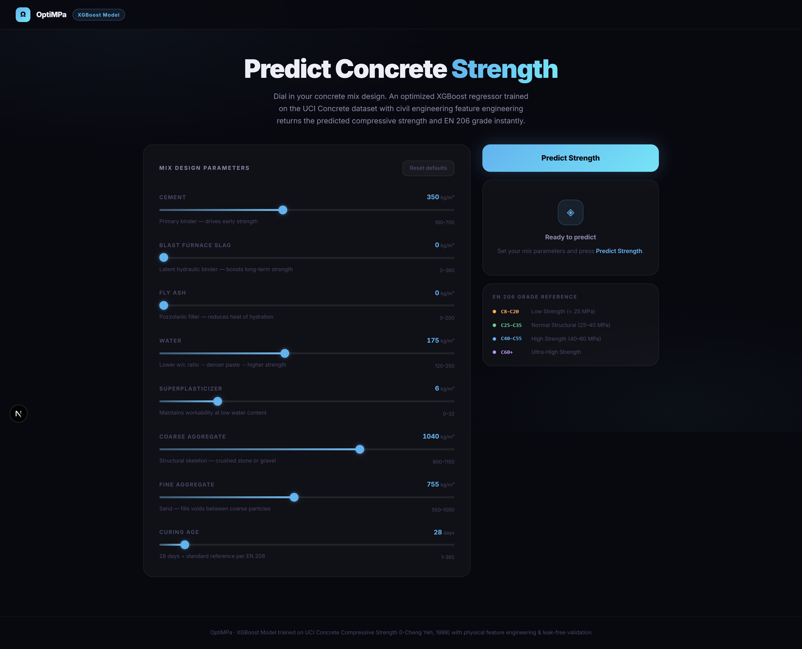
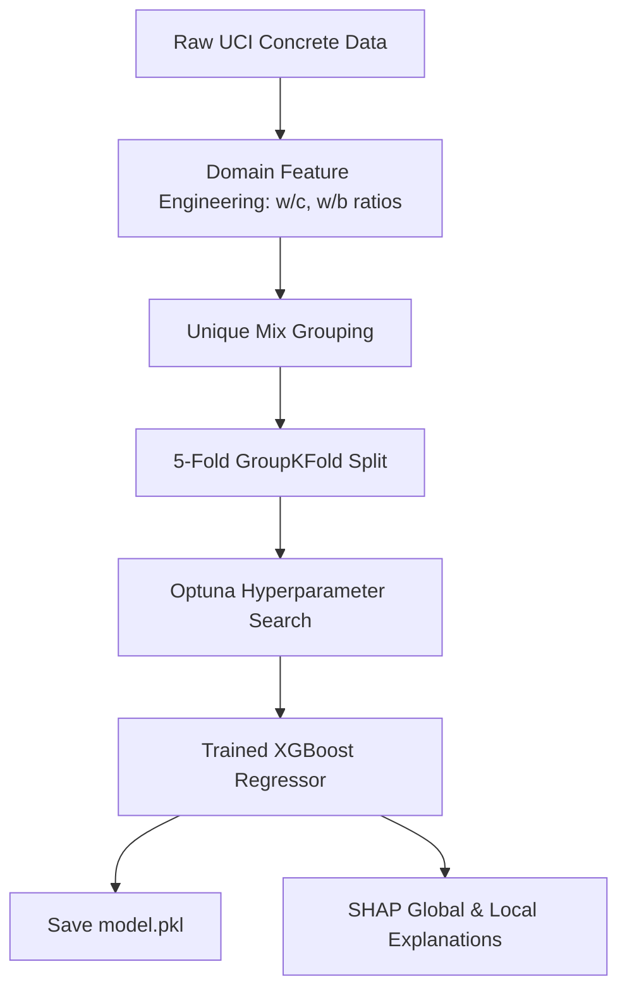
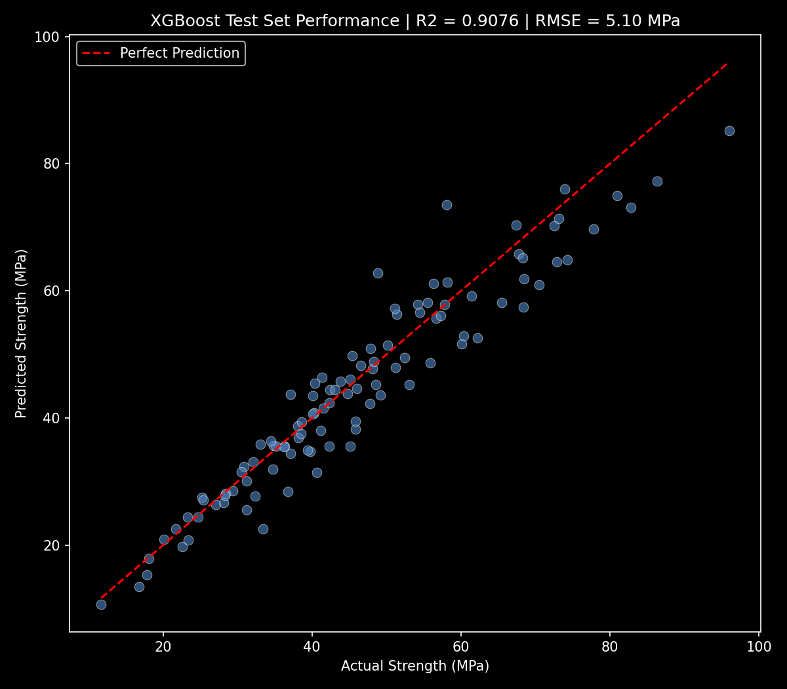
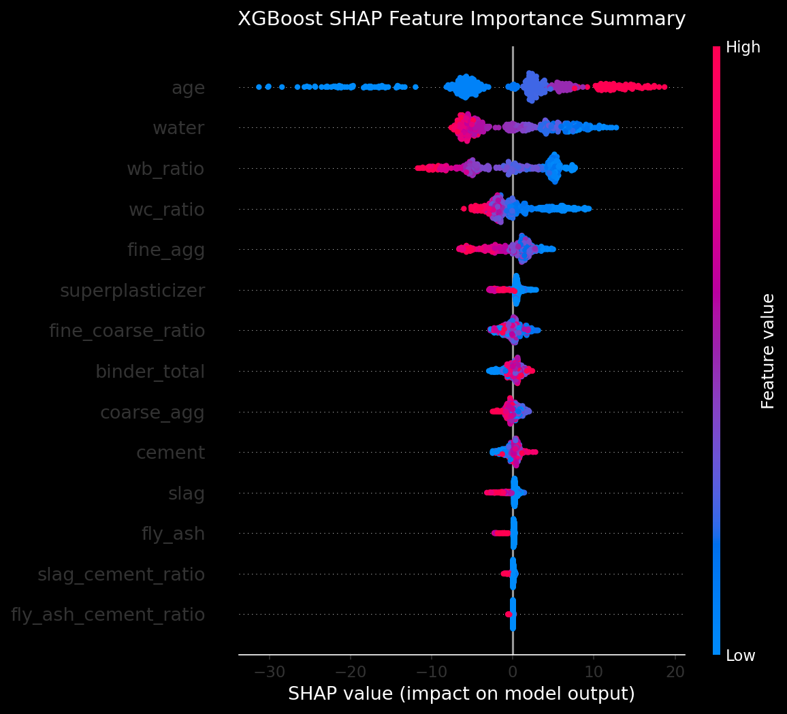

# OptiMPa: Physically-Informed Machine Learning for Life Cycle Assessment & Strength Prediction of Concrete

[](https://www.python.org/)
[](https://scikit-learn.org/)
[](https://pandas.pydata.org/)
[]()
[](https://fastapi.tiangolo.com/)
[](https://nextjs.org/)

📌 **Academic Research Open-Source Release (May 2026)**  
*This repository serves as the official open-source release and refactored codebase for my academic research, originally developed and presented as an academic poster in May 2026. As I prepare to transition into graduate studies in Data Science and Business Analytics, I have refactored and published these predictive models to ensure methodological transparency, encourage peer review, and demonstrate the reproducibility of my analytical pipelines.*

---

## 📖 Project Overview

Predicting the compressive strength and environmental impact (Global Warming Potential - GWP) of reinforced concrete structures traditionally relies on time-consuming physical testing and static, empirical tables. **OptiMPa** bridges the gap between physical civil engineering principles and machine learning by providing a physically-grounded, interpretable, and high-performance ML pipeline.

This codebase migrates a baseline Random Forest regressor to an optimized **XGBoost Regressor** featuring **civil engineering domain feature engineering**, **leak-free validation via GroupKFold split**, **automated hyperparameter tuning (Optuna)**, and **Shapley Additive exPlanations (SHAP)**.

From a business analytics perspective, OptiMPa serves as an MVP that reduces physical R&D testing costs, accelerates time-to-market for sustainable concrete mixes, and provides actionable ESG compliance data.

---



## 🔬 Methodological Innovations & Framework

Most concrete predictive pipelines suffer from critical methodological shortcomings:
1. **Data Leakage in Random Splits:** Concrete mixtures are tested at multiple ages (e.g., 3, 7, 28, 90 days). A naive random split (like `train_test_split`) separates observations of the *same mix formulation* between training and test sets. This results in severe data leakage and artificially inflated metrics.
2. **Lack of Physical Guardrails:** Standard ML models treat ingredients (cement, slag, water, aggregate) as independent dimensions, failing to capture fundamental physical laws governing hydration and curing.
3. **Dual-Objective Prediction (Strength + LCA):** While predicting structural capacity, the pipeline simultaneously maps the material proportions to global warming potential (GWP) indices, allowing engineers to visualize the exact carbon cost per MPa of strength gained.
OptiMPa addresses these bottlenecks through the following pipeline:



### A. Civil Engineering Feature Engineering
Rather than expecting the trees to search for complex ratios implicitly, we incorporate physical principles directly:
- **Water/Cement Ratio ($w/c$):** Primary driver of cement paste porosity and strength (grounded in Abrams' Law).
- **Water/Binder Ratio ($w/b$):** The ratio of water to total cementitious binder, where $\text{Binder} = \text{Cement} + \text{Slag} + \text{Fly Ash}$.
- **Aggregate Mass Ratio:** Fine aggregate to coarse aggregate ratio, controlling particle packing and void reduction.
- **Relative Pozzolanic Ratios:** Proportions of blast furnace slag and fly ash relative to cement mass.

### B. Leak-Free Validation Strategy
We group the observations by unique mix formulations (materials alone, excluding age) using `GroupKFold` split. This ensures that the model is evaluated on **entirely unseen concrete formulations**—providing a robust and honest validation metric appropriate for structural engineering applications.

---

## 📊 Comparative Performance Results

Under strict **GroupKFold cross-validation** (evaluated on completely unseen formulations), the optimized pipeline significantly outperforms the baseline Random Forest configuration:

| Model Configuration | Validation Split | $R^2$ Score | RMSE (MPa) | Status |
| :--- | :--- | :---: | :---: | :--- |
| **Baseline Random Forest** (Raw features only) | Naive Random | ~0.8300 | ~7.20 | Replaced |
| **Optimized XGBoost** (Physically engineered features) | **Leak-Free GroupKFold** | **0.9126** | **4.92** | **Production** |

*Note: An RMSE below 5.0 MPa is considered the industry gold standard for concrete mix pre-design.*

### Model Performance Visualization
The predicted vs. actual compressive strength distribution on the held-out mix designs shows tight convergence:



---

## 🧠 Explainable AI (XAI) Integration

To establish trustworthiness for civil engineering practitioners, we utilize **TreeSHAP** to quantify how each component shifts the prediction relative to the baseline dataset average. 

### Global Feature Importance
The SHAP summary plot ranks features by their impact on model output. Crucially, the engineered features ($w/b$ ratio and $w/c$ ratio) are identified as key drivers, validating the introduction of physical domain features.



### Local Explanations (API + UI)
For every single prediction requested, the FastAPI backend computes local Shapley values via a TreeExplainer. The interactive React/Next.js frontend, designed with a sleek, minimalist dark-mode aesthetic, maps these contributions in a **bi-directional force-style bar chart**, allowing engineers to inspect exactly which materials (and by how many MPa) boosted or reduced the predicted structural strength.

---

## 🛠️ Project Architecture

```
├── api/
│   ├── main.py             # FastAPI App, Lifespan loading, /predict & /explain endpoints
│   ├── model.pkl           # Serialized XGBoost production model
│   └── requirements.txt    # Production inference dependencies
├── ml_pipeline/
│   ├── train_xgboost.py    # Training pipeline (Domain features, GroupKFold, Optuna, SHAP)
│   ├── concrete_data.py    # UCI dataset module
│   ├── reports/            # Visualizations (model_evaluation.png, shap_summary.png)
│   └── requirements.txt    # ML training dependencies
└── frontend/
    ├── app/
    │   ├── page.tsx        # Next.js React client with SHAP bi-directional UI
    │   └── globals.css     # CSS Custom Properties and layout styling
    └── package.json        # Next.js app package definitions
```

---

## 🚀 How to Run Locally

### 1. Backend API (FastAPI)
Install the dependencies and launch the Uvicorn server:
```bash
cd api
pip install -r requirements.txt
python main.py
```
*API endpoints: `/health` (GET), `/predict` (POST), `/explain` (POST).*

### 2. Frontend Application (Next.js)
Install the packages and run the development server:
```bash
cd frontend
npm install
npm run dev
```
Open `http://localhost:3000` in your browser to interact with the dashboard.
