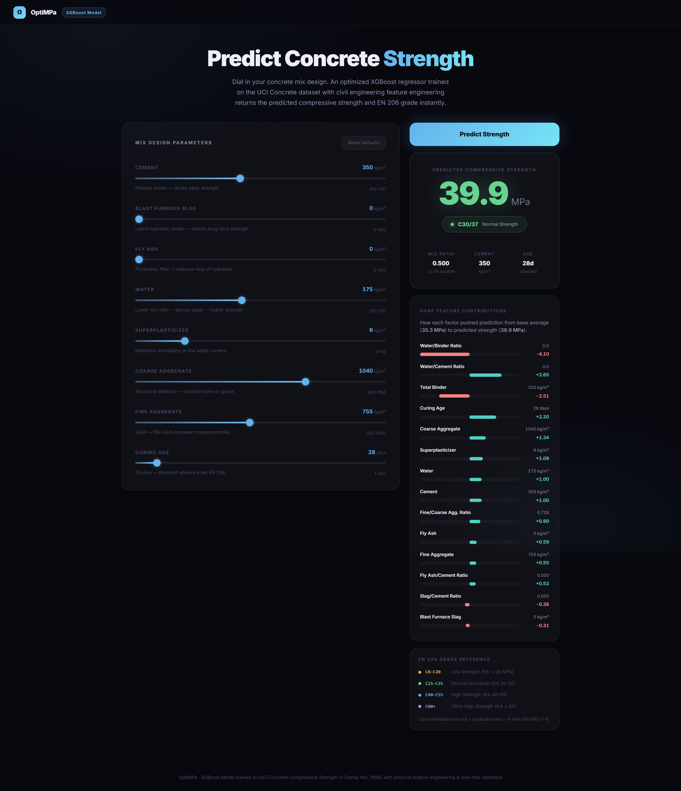
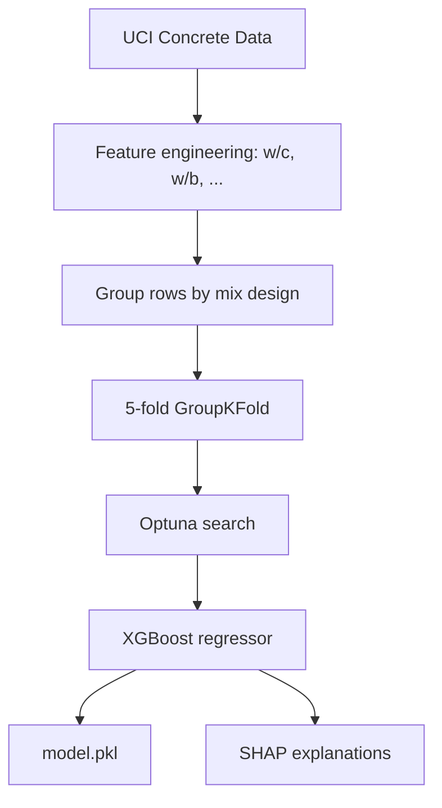
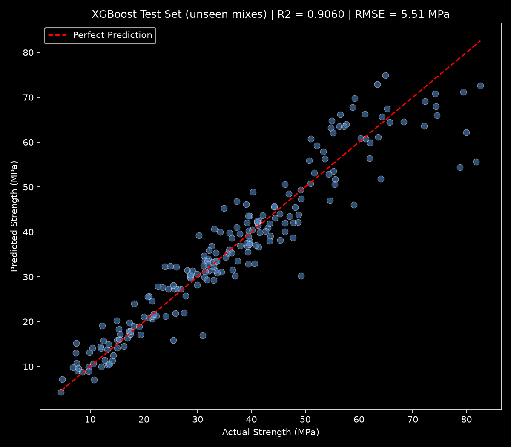
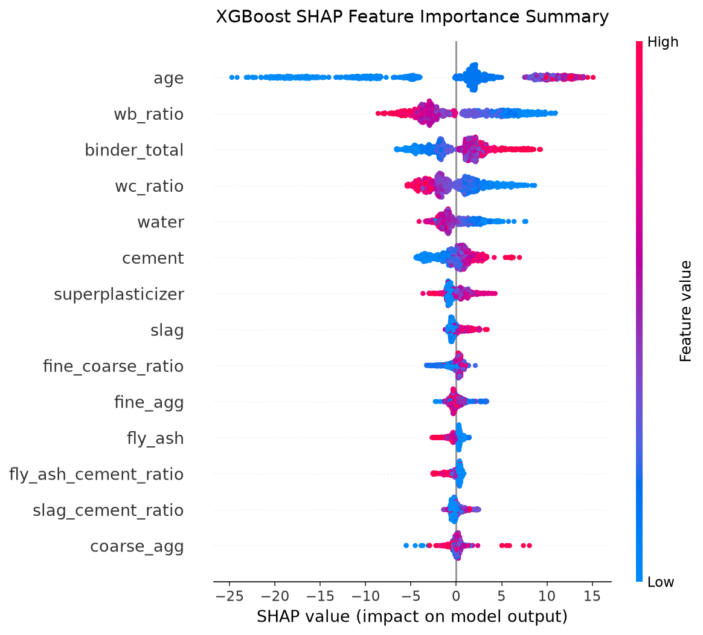

# OptiMPa: Concrete Compressive Strength Prediction with Physically-Informed ML

[](https://www.python.org/)
[](https://xgboost.readthedocs.io/)
[](https://fastapi.tiangolo.com/)
[](https://nextjs.org/)

This is the code behind the academic poster I presented in May 2026. I cleaned it up and published it so the method and the numbers can be checked and reproduced.

OptiMPa predicts the compressive strength of a concrete mix (in MPa) from its ingredients and curing age. It is trained on the UCI Concrete Compressive Strength dataset (Yeh, 1998) and has three parts:

- **`ml_pipeline/`**: training an XGBoost regressor with engineering-based features, grouped cross-validation, Optuna tuning and SHAP
- **`api/`**: a FastAPI service that serves predictions and per-prediction SHAP explanations
- **`frontend/`**: a Next.js page where you set the mix with sliders and see the predicted strength, the EN 206 class and the SHAP breakdown



## Method


```mermaid
graph TD
    A[UCI Concrete Data] --> B[Feature engineering: w/c, w/b, ...]
    B --> C[Group rows by mix design]
    C --> D[5-fold GroupKFold]
    D --> E[Optuna search]
    E --> F[XGBoost regressor]
    F --> G[model.pkl]
    F --> H[SHAP explanations]
```

### Features from concrete technology

On top of the 8 raw inputs, the model gets the ratios that concrete technology says matter, instead of having to find them on its own:

- **Water/cement ratio (w/c)**: the main driver of paste porosity and strength (Abrams' law)
- **Water/binder ratio (w/b)**: water over total binder, where binder = cement + slag + fly ash
- **Total binder**
- **Fine/coarse aggregate ratio**: related to particle packing
- **Slag/cement and fly ash/cement ratios**

### Avoiding leakage between train and test

The same mix is tested at several ages (3, 7, 28, 90 days ...). With a plain random split, the same mix shows up in both train and test, and the scores come out too optimistic. Here rows are grouped by mix design (the 7 ingredients, without age), so every validation and test score is measured on mixes the model has never seen.

## Results

**Data:** the official UCI file has 1030 rows. After removing its 25 exact duplicate rows, 1005 observations from 428 different mixes remain. 80% of the mixes (342) are used for training and tuning; 20% (86) are held out as a test set. Both models below are evaluated the same way: 5-fold GroupKFold CV on the training mixes, then the held-out mixes.

| Model | CV R² | CV RMSE (MPa) | Test R² | Test RMSE (MPa) |
| :--- | :---: | :---: | :---: | :---: |
| Random Forest baseline (8 raw features) | 0.860 | 5.86 | 0.864 | 6.63 |
| **XGBoost (14 features, tuned)** | **0.900** | **4.93** | **0.906** | **5.51** |

To reproduce, run `python ml_pipeline/train_xgboost.py`. The Optuna search is seeded (50 trials). All numbers and the chosen hyperparameters are in [`ml_pipeline/example_reports/metrics.json`](ml_pipeline/example_reports/metrics.json).

Predicted vs. actual strength on the held-out mixes:



## Explainability (SHAP)

TreeSHAP shows how much each input pushes a prediction up or down from the dataset average. In the global summary, curing age has the largest effect, followed by the w/b ratio, total binder and the w/c ratio. Three of the top four are engineered features.



For every request, the API also returns local SHAP values, and the frontend draws them as a two-sided bar chart. This shows which ingredients raised or lowered that particular prediction, and by how many MPa.

### EN 206 class

The model predicts mean cylinder strength (f<sub>cm</sub>). To assign a class, the characteristic strength is estimated as f<sub>ck</sub> = f<sub>cm</sub> − 8 MPa (EN 1992-1-1, Table 3.1), and the highest EN 206 class that f<sub>ck</sub> meets is reported. This is only an estimate; it does not replace a conformity assessment.

## Limitations and next steps

- The dataset is a single lab dataset of about 1000 rows, so predictions outside its ranges (enforced by the API) should not be trusted.
- **Life cycle assessment (GWP)** was part of the original poster idea, but it is not implemented in this repository yet. A planned next step is to attach emission factors to each ingredient and show kg CO₂-eq per m³ next to the predicted strength.

## Project structure

```
├── api/
│   ├── main.py             # FastAPI app: /health, /predict, /explain
│   ├── model.pkl           # Trained XGBoost model
│   └── requirements.txt
├── ml_pipeline/
│   ├── train_xgboost.py    # Features, GroupKFold, Optuna, SHAP, export to api/model.pkl
│   ├── concrete_data.py    # UCI dataset (1030 rows), embedded so training works offline
│   ├── example_reports/    # Plots and metrics.json from the current model
│   └── requirements.txt
└── frontend/
    ├── app/page.tsx        # Mix sliders, result card, SHAP chart
    └── package.json
```

## Running locally

**API**

```bash
cd api
pip install -r requirements.txt
python main.py
```

Endpoints: `GET /health`, `POST /predict`, `POST /explain`. Interactive docs are at `http://localhost:8000/docs`.

**Frontend**

```bash
cd frontend
npm install
npm run dev
```

Then open `http://localhost:3000`.

**Retraining** (optional, a few minutes)

```bash
cd ml_pipeline
pip install -r requirements.txt
python train_xgboost.py
```
