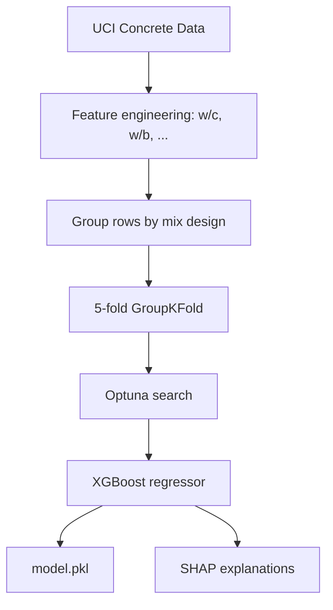

# OptiMPa: Concrete Compressive Strength Prediction with Physically-Informed ML

[](https://www.python.org/)
[](https://xgboost.readthedocs.io/)
[](https://fastapi.tiangolo.com/)
[](https://nextjs.org/)

This is the code behind the academic poster I presented in May 2026. I cleaned it up and published it so the method and the numbers can be checked and reproduced.

OptiMPa predicts the compressive strength of a concrete mix (in MPa) from its ingredients and curing age, and estimates the mix's embodied carbon. It is trained on the UCI Concrete Compressive Strength dataset (Yeh, 1998).

- **`frontend/`**: the website. It has three pages:
  - **Predictor:** set the mix and see the strength, EN 206 class, SHAP breakdown, kg CO₂e/m³, and a comparison with a Portland-cement-only mix.
  - **BIM carbon:** open an IFC file and get the concrete volumes and embodied carbon of the building.
  - **Model:** how the model was built and validated.
  
  The model runs in the browser, so the site needs no server and can be hosted on Vercel as is.
- **`ml_pipeline/`**: trains the XGBoost model (engineering-based features, grouped cross-validation, Optuna tuning, SHAP) and exports it for the website.
- **`bim/`**: the same IFC → embodied carbon calculation as a Python command-line tool (IfcOpenShell).
- **`api/`**: an optional FastAPI service with the same predictions, for use from other programs.


## Method


```mermaid
graph TD
    A[UCI Concrete Data] --> B[Feature engineering: w/c, w/b, ...]
    B --> C[Group rows by mix design]
    C --> D[5-fold GroupKFold]
    D --> E[Optuna search]
    E --> F[XGBoost regressor]
    F --> G[model.pkl]
    F --> H[SHAP explanations]
```

### Features from concrete technology

On top of the 8 raw inputs, the model gets the ratios that concrete technology says matter, instead of having to find them on its own:

- **Water/cement ratio (w/c)**: the main driver of paste porosity and strength (Abrams' law)
- **Water/binder ratio (w/b)**: water over total binder, where binder = cement + slag + fly ash
- **Total binder**
- **Fine/coarse aggregate ratio**: related to particle packing
- **Slag/cement and fly ash/cement ratios**

### Avoiding leakage between train and test

The same mix is tested at several ages (3, 7, 28, 90 days ...). With a plain random split, the same mix shows up in both train and test, and the scores come out too optimistic. Here rows are grouped by mix design (the 7 ingredients, without age), so every validation and test score is measured on mixes the model has never seen.

## Results

**Data:** the official UCI file has 1030 rows. After removing its 25 exact duplicate rows, 1005 observations from 428 different mixes remain. 80% of the mixes (342) are used for training and tuning; 20% (86) are held out as a test set. Both models below are evaluated the same way: 5-fold GroupKFold CV on the training mixes, then the held-out mixes.

| Model | CV R² | CV RMSE (MPa) | Test R² | Test RMSE (MPa) |
| :--- | :---: | :---: | :---: | :---: |
| Random Forest baseline (8 raw features) | 0.860 | 5.86 | 0.864 | 6.63 |
| **XGBoost (14 features, tuned)** | **0.900** | **4.93** | **0.906** | **5.51** |

To reproduce, run `python ml_pipeline/train_xgboost.py`. The Optuna search is seeded (50 trials). All numbers and the chosen hyperparameters are in [`ml_pipeline/example_reports/metrics.json`](ml_pipeline/example_reports/metrics.json).

Predicted vs. actual strength on the held-out mixes:


## Explainability (SHAP)

TreeSHAP shows how much each input pushes a prediction up or down from the dataset average. In the global summary, curing age has the largest effect, followed by the w/b ratio, total binder and the w/c ratio. Three of the top four are engineered features.


For every mix, the website also computes local SHAP values and draws them as a two-sided bar chart. This shows which ingredients raised or lowered that particular prediction, and by how many MPa.

### Running the model in the browser

`ml_pipeline/export_web_model.py` writes the trained trees to `frontend/app/lib/model.json` (430 KB). `frontend/app/lib/model.ts` evaluates them and computes SHAP values with the same TreeSHAP algorithm the Python `shap` package uses. `npm run test:model` compares it with Python on 400 mixes. The largest difference is 0.0001 MPa for the prediction and 0.00003 for any SHAP value.

### EN 206 class

The model predicts mean cylinder strength (f<sub>cm</sub>). To assign a class, the characteristic strength is estimated as f<sub>ck</sub> = f<sub>cm</sub> − 8 MPa (EN 1992-1-1, Table 3.1), and the highest EN 206 class that f<sub>ck</sub> meets is reported. This is only an estimate; it does not replace a conformity assessment.

## Embodied carbon

The carbon of 1 m³ of concrete is each ingredient's mass times its emission factor (kg CO₂e/kg), summed. This covers material production only (A1–A3). The factors are approximate generic values, mostly from ICE v3.0. They are fine for comparing mixes; for a real assessment, use the EPDs of the actual materials.

The predictor compares each mix with a **reference mix**. The reference is the same mix with all binder as Portland cement (slag and fly ash replaced 1:1), so the binder content and w/b ratio stay the same. Both mixes go through the strength model, so you see the carbon saved and what it costs in predicted strength.

### From a BIM model

Both the **BIM carbon** page and [`bim/ifc_carbon.py`](bim/README.md) read an IFC file and find the concrete elements and their volumes. Volumes come from the quantity sets, or from the geometry when those are missing. Each element gets a mix by strength class, and the result is the embodied carbon of the concrete in t CO₂e. The strength model also checks whether each mix reaches the class it is used for. On the website the file is read in the browser with [web-ifc](https://github.com/ThatOpen/engine_web-ifc) and never uploaded. `npm run test:ifc` checks that it gives the same volumes as the Python tool on the sample building.

```bash
cd bim
pip install -r requirements.txt
python ifc_carbon.py examples/sample_building.ifc --mixes mixes.example.json --api http://localhost:8000
```

## Limitations and next steps

- The dataset is a single lab dataset of about 1000 rows, so predictions outside its ranges should not be trusted. The website shows a warning in that case.
- Only cement, slag and fly ash are covered as binders.
- The carbon numbers use generic factors and cover the concrete only (no reinforcement, transport or later life stages).

## Project structure

```
├── api/
│   ├── main.py             # FastAPI app: /health, /predict, /explain
│   ├── model.pkl           # Trained XGBoost model
│   └── requirements.txt
├── ml_pipeline/
│   ├── train_xgboost.py    # Features, GroupKFold, Optuna, SHAP, export to api/model.pkl
│   ├── export_web_model.py # model.pkl -> frontend/app/lib/model.json (+ test vectors, plots)
│   ├── concrete_data.py    # UCI dataset (1030 rows), embedded so training works offline
│   ├── example_reports/    # Plots and metrics.json from the current model
│   └── requirements.txt
├── bim/
│   ├── ifc_carbon.py       # IFC -> concrete volumes -> embodied carbon
│   ├── carbon.py           # kg CO2e per m3 of a mix (emission factors)
│   ├── mixes.example.json
│   └── examples/           # Sample IFC model and the script that builds it
└── frontend/
    ├── app/page.tsx        # Predictor: sliders, strength, SHAP, carbon, reference mix
    ├── app/bim/page.tsx    # IFC upload -> concrete volumes -> embodied carbon
    ├── app/model/page.tsx  # Data, method, results
    ├── app/lib/            # model.ts (trees + TreeSHAP), carbon.ts, ifc.ts, model.json
    └── scripts/            # test-model.mts, test-ifc.mts, copy-wasm.mjs
```

## Running locally

**Website** (no Python needed)

```bash
cd frontend
npm install
npm run dev
```

Then open `http://localhost:3000`. To check the browser model and IFC reader: `npm run test:model` and `npm run test:ifc`.

**Deploying to Vercel:** import the repository and set **Root Directory** to `frontend`. Everything else is the default (Next.js, `npm run build`). The pages are static, so no server or environment variables are needed.

**API** (optional)

```bash
cd api
pip install -r requirements.txt
python main.py
```

Endpoints: `GET /health`, `POST /predict`, `POST /explain`. Interactive docs are at `http://localhost:8000/docs`.

**Retraining** (optional, a few minutes)

```bash
cd ml_pipeline
pip install -r requirements.txt
python train_xgboost.py
python export_web_model.py   # update the website's copy of the model
```
